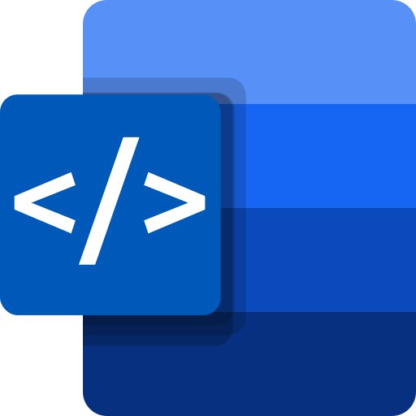

# DocTML (Document Text Mark-up Language) 

〚 [Web demo](http://kildom.github.io/xml2docx/) 〛&nbsp;
〚 [Documentation](http://kildom.github.io/xml2docx/docs.html) 〛&nbsp;
〚 [Download](https://github.com/kildom/xml2docx/releases/latest) 〛&nbsp;

**Easily generate a Word Document from a simple HTML-like file.**

## Key Features

* [**Command line**](https://kildom.github.io/xml2docx/docs.html#cli-md) interface
  and [**web**](https://kildom.github.io/xml2docx/) interface
  are available.
* [**HTML-like syntax**](https://kildom.github.io/xml2docx/docs.html#syntax-md)
  of the input file makes it easier for users with a basic understanding of HTML.
* [**Commonly used features**](https://kildom.github.io/xml2docx/docs.html#document-md)
  of the Word Document are available.
* [**Templating**](https://kildom.github.io/xml2docx/docs.html#template-md)
  allows you to customize the output using a JSON input data.

